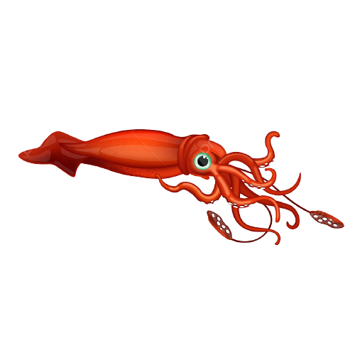

```{r, eval = FALSE}
remotes::install_github("rstudio/leaflet", ref="joe/feature/raster-options")

```


```{r, datapull, include = FALSE}
library(ggplot2)
library(flexdashboard)
library(shiny)
library(ggplot2)
library(lubridate)
library(dplyr)
library(leaflet)
library(leaflet.extras2)
library(RColorBrewer)
library(oce) # oceColorsChlorophyll
library(terra)
library(ggridges)
library(sf)
library(magick)
library(viridis)
#setwd(here::here('app/')) # need this to run locally 
source('functions/process_data.R')
# Pulling in rasters and shapefile data
load("data/app_shapes.RData")
e <- new.env()

# -- SST (weekly mean) Spatraster objects
sst.r.2021 <- terra::rast('tifs/sst_2021.tif')
names(sst.r.2021) <- c(1:52)
e$sst.r.2021 <- sst.r.2021
sst.r.2022 <- terra::rast('tifs/sst_2022.tif')
names(sst.r.2022) <- c(1:52)
e$sst.r.2022 <- sst.r.2022
sst.r.2023 <- terra::rast('tifs/sst_2023.tif')
names(sst.r.2023) <- c(1:52) # this is temporary while we figure out sst
e$sst.r.2023 <- sst.r.2023
sst.r.2024 <- terra::rast('tifs/sst_2024.tif')
names(sst.r.2024) <- c(1:30) # this is temporary while we figure out sst
e$sst.r.2024 <- sst.r.2024
#ls(e)

# -- SST (anomalies) Spatraster objects
sst.anom.2021 <- terra::rast('tifs/sst_anom_2021.tif')
names(sst.anom.2021) <- c(1:52)
e$sst.anom.2021 <- sst.anom.2021
sst.anom.2022 <- terra::rast('tifs/sst_anom_2022.tif')
names(sst.anom.2022) <- c(1:52)
e$sst.anom.2022 <- sst.anom.2022
sst.anom.2023 <- terra::rast('tifs/sst_anom_2023.tif')
names(sst.anom.2023) <- c(1:52)
e$sst.anom.2023 <- sst.anom.2023
sst.anom.2024 <- terra::rast('tifs/sst_anom_2024.tif')
names(sst.anom.2024) <- c(1:30)
e$sst.anom.2024 <- sst.anom.2024

# -- CHL (weekly mean) Spatraster objects
chl.r.2021 <- terra::rast('tifs/chl_2021.tif')
names(chl.r.2021) <- c(1:52)
e$chl.r.2021 <- chl.r.2021
chl.r.2022 <- terra::rast('tifs/chl_2022.tif')
names(chl.r.2022) <- c(1:52)
e$chl.r.2022 <- chl.r.2021
chl.r.2023 <- terra::rast('tifs/chl_2023.tif')
names(chl.r.2023) <- c(1:52)
e$chl.r.2023 <- chl.r.2023
chl.r.2024 <- terra::rast('tifs/chl_2024.tif')
names(chl.r.2024) <- c(1:30)
e$chl.r.2024 <- chl.r.2024

# -- CHL (anomalies) Spatraster objects
chl.anom.2021 <- terra::rast('tifs/chl_anom_2021.tif')
names(chl.anom.2021) <- c(1:52)
e$chl.anom.2021 <- chl.anom.2021
chl.anom.2022 <- terra::rast('tifs/chl_anom_2022.tif')
names(chl.anom.2022) <- c(1:52)
e$chl.anom.2022 <- chl.anom.2022
chl.anom.2023 <- terra::rast('tifs/chl_anom_2023.tif')
names(chl.anom.2023) <- c(1:52)
e$chl.anom.2023 <- chl.anom.2023
chl.anom.2024 <- terra::rast('tifs/chl_anom_2024.tif')
names(chl.anom.2024) <- c(1:30)
e$chl.anom.2024 <- chl.anom.2024


# -- SST Fronts - outdated, just leaving for example 
fronts <- terra::rast('tifs/ww_acspo_15x15_fprob_2023.tif')
names(fronts) <- c(1:17)
fronts.r <- fronts[[17]]

# -- DOPPIO Model Output
bt <- raster::brick('tifs/b_ww_btmp_19.tif')
sal <- raster::brick('tifs/b_ww_sal_222m_20.tif')

# -- Read in study fleet data
sf.df <- read.csv('data/illex_pull_plot_data_for_sarah_s.csv') # need to create function for this

# -- Read in the ILXSM data 
ml_wt <- process_bsm_data("data/ilxsm/ILXSM_EntirePull_07-11-2024.csv")

# -- Read in SQUIBS data
df <- read.csv('data/squibs/2024-07-01_SQUIBS_Pull.csv')

# -- Set up color palettes
cols = rev(RColorBrewer::brewer.pal(11,'RdYlBu'))
pal <- colorRampPalette(cols)(30)
cols2 = rev(brewer.pal(11,'PRGn'))
pal2 <- colorRampPalette(cols2)(30)
cols3 = rev(brewer.pal(11,'BrBG'))
pal3 <- colorRampPalette(cols3)(30)
cols.anom = rev(brewer.pal(11,'PuOr'))
pal.anom <- colorRampPalette(cols.anom)(30)
fronts.pal <- scales::viridis_pal(option = "plasma")(25)
chl_cols = oce::oceColorsChlorophyll(16)
jet.colors <- colorRampPalette(c("blue", "#007FFF", "cyan","#7FFF7F", "yellow", "#FF7F00", "red", "#7F0000"))

my_breaks <- c(0,100,1000,10000,50000,Inf)

sf.pal <- leaflet::colorBin("YlOrRd", domain = sf.df$SUM_Illex_CATCH,
                   bins = my_breaks,
                na.color = "transparent")

# source_code: embed
```

Oceanography
===================================== 

Column {data-width=350}
-----------------------------------------------------------------------
### Select your view
  
#### Use the drop down list and slider bar below to select the time frame of interest for satellite data images.

```{r, mainpage toggles}

fillCol(height = 200, flex = c(2, 2, 2),
        inputPanel(
          selectInput("satyear",
                      label = ("Select Year"),
                      choices = list('2021', '2022', '2023', '2024'),
                      selected = '2023'),
          sliderInput("weekofyear", "Select week of year",
                      min = 1, max = 52,  value = 12))
)


# 

```

### Sea Surface Temperature

```{r, sstmap}

renderLeaflet({
  sst = get((pattern = paste0('sst.r.', input$satyear)), envir = e)
  sst.r <- sst[[input$weekofyear]]
  sst.anom <- get((pattern = paste0('sst.anom.', input$satyear)), envir = e)
  sst.anom.r <-  sst.anom[[input$weekofyear]]
  
  # fronts.r <-  fronts[[input$weekofyear]]
  # fronts.r <- fronts[[17]]
  leaflet(options = leafletOptions(attributionControl=FALSE)) %>% 
    addMapPane("right", zIndex = 0)  %>%  
    addMapPane("left",  zIndex = 0) %>% 
    addProviderTiles(group="Base map",
                     "Esri.OceanBasemap", layerId = "baseid1", 
                     options = pathOptions(pane = "right")) %>%
    addProviderTiles(group="Base map",
                     "Esri.OceanBasemap", layerId = "baseid2", 
                     options = pathOptions(pane = "left")) %>%
    setMaxBounds(lng1=-75, lng2=-65,
                 lat1=35, lat2=44) %>%
    setView(lng = -75.00, lat = 34.45, zoom = 5) %>%
    setView(lng = -62.00, lat = 45.45, zoom = 5) %>%
    # Overlay groups
    addPolygons(data = canyons,
                color = 'cornsilk1',
                weight = 1,  # border thickness
                opacity = 0.5, # border opacity
                label= ~Name,
                fillOpacity = 0.7,
                labelOptions = labelOptions(
                  style = list("font-weight" = "normal",
                               "padding" = "3px 8px"),
                  "textsize" = "13px"),
                group = 'Canyons') %>%
    # addPolygons(data = iso100, 
    #             color = '#1F78B4FF',
    #             weight = 1,  # border thickness
    #             opacity = 0.5, # border opacity
    #             group = '91m isobath') %>%
    # addPolygons(data = iso91, 
    #             color = '#1F78B4FF',
    #             weight = 1,  # border thickness
    #             opacity = 0.5, # border opacity
    #             group = '100m isobath') %>%
    # Overlay groups
  #addRasterImage(fronts.r, colors = fronts.pal, group = "Fronts") %>% 
  # addGraticule(interval = 5, style = list(color = "#FFFFFF", weight = 2), 
  #              group = 'Grid') %>% 
  # add graticules from a NOAA webserver (recommended for interactive plot)
  addWMSTiles(
    "https://gis.ngdc.noaa.gov/arcgis/services/graticule/MapServer/WMSServer/",
    layers = c("1-degree grid", "5-degree grid"),
    options = WMSTileOptions(format = "image/png8", transparent = TRUE),
    attribution = NULL,group = 'Graticules') %>%
    addRasterImage(sst.r, colors = jet.colors(25),
                   options = leafletOptions(pane = "right"), group = "r1") %>%
    addRasterImage(sst.anom.r, colors = pal.anom,
                   options = leafletOptions(pane = "left"), group = "r2") %>%
    
    # Layers control
    addLayersControl(
      #baseGroups = c('Bathymetry'),
      # overlayGroups = c('Canyons','91m isobath', '100m isobath', 'Fronts', 'Grid'),
      overlayGroups = c('Canyons', 'Grid'),
      position = 'topleft',
      options = layersControlOptions(collapsed = FALSE)) %>%
    addSidebyside(layerId = "sidecontrols",
                  rightId = "baseid2",
                  leftId  = "baseid1") %>%
    # add a map scale bar
    addScaleBar(position = 'topright')
  
  # addControl(
  #   html = "<p> Left pane is the weekly mean SST and right pane is SST anomaly </p>",
  #   position = "topleft")
})


# add  legends

  
```

Column {data-width=350}
-----------------------------------------------------------------------

### Chlorophyll-A

```{r, chl map}
coords=data.frame(
  lat=as.numeric(c(34.0150756835938, 45.9849243164062)),
  lon=as.numeric(c(-77.9732437133789, -62.0267562866211)))
renderLeaflet({
  chl = get((pattern = paste0('chl.r.', input$satyear)), envir = e)
  chl.r <- chl[[input$weekofyear]]
  
  chl.anom <- get((pattern = paste0('chl.anom.', input$satyear)), envir = e)
  chl.anom.r <-  chl.anom[[input$weekofyear]]
  
  leaflet(options = leafletOptions(attributionControl=FALSE)) %>% 
    addMapPane("right", zIndex = 0)  %>%  
    addMapPane("left",  zIndex = 0) %>% 
    addProviderTiles(group="Base map",
                     "Esri.OceanBasemap", layerId = "baseid1",
                     options = pathOptions(pane = "right")) %>%
    addProviderTiles(group="Base map",
                     "Esri.OceanBasemap", layerId = "baseid2",
                     options = pathOptions(pane = "left")) %>%
    setMaxBounds(lng1=-75, lng2=-65,
                 lat1=35, lat2=44) %>%
    leaflet::setView(lng = -75.00, lat = 34.45, zoom = 5) %>%
    leaflet::setView(lng = -62.00, lat = 45.45, zoom = 5) %>%
    leaflet::addMarkers(lng=coords$lon,lat=coords$lat) %>% 
    # Overlay groups
    addPolygons(data = canyons, 
                color = 'cornsilk1',
                weight = 1,  # border thickness
                opacity = 0.5, # border opacity
                label= ~Name,
                fillOpacity = 0.7,
                labelOptions = labelOptions(
                  style = list("font-weight" = "normal", 
                               "padding" = "3px 8px"),
                  "textsize" = "13px"), 
                group = 'Canyons') %>%
    # addPolygons(data = iso100, 
    #             color = '#1F78B4FF',
    #             weight = 1,  # border thickness
    #             opacity = 0.5, # border opacity
    #             group = '91m isobath') %>%
    # addPolygons(data = iso91, 
    #             color = '#1F78B4FF',
    #             weight = 1,  # border thickness
    #             opacity = 0.5, # border opacity
    #             group = '100m isobath') %>%
    addGraticule(interval = 5, style = list(color = "#FFFFFF", weight = 2), 
                 group = 'Grid') %>% 
    # # Overlay groups
    addRasterImage(log(chl.r),colors = chl_cols,
                   options = leafletOptions(pane = "right"), group = "r1") %>%
    addRasterImage(log(chl.anom.r), colors = pal.anom,
                   options = leafletOptions(pane = "left"), group = "r2") %>%
    # Layers control
    addLayersControl(
      # baseGroups = c('Bathymetry'),
      # overlayGroups = c('Canyons','91m isobath', '100m isobath', 'Grid'),
      overlayGroups = c('Canyons', 'Grid'),
      position = 'topleft',
      options = layersControlOptions(collapsed = FALSE)
    ) %>%
    addSidebyside(layerId = "sidecontrols",
                  rightId = "baseid2",
                  leftId  = "baseid1") %>%
    # add a map scalebar
    addScaleBar(position = 'topright')
  
})
```


### Bottom Temperature and Salinity at Depth

```{r, bt map}
leaflet(options = leafletOptions(attributionControl=FALSE)) %>% 
  # Base groups
  addProviderTiles(group="Base map",
                   "Esri.OceanBasemap") %>%
  setMaxBounds(lng1=-75, lng2=-65,
               lat1=35, lat2=44) %>%
  setView(lng = -75.00, lat = 34.45, zoom = 5) %>%
  setView(lng = -70.85, lat = 45.45, zoom = 5) %>%
  addPolygons(data = canyons,
              fill = 'cornsilk1',
              color = 'black',
              weight = 1,  # border thickness
              opacity = 0.5, # border opacity
              label= ~Name,
              fillOpacity = 0.7,
              labelOptions = labelOptions(
                style = list("font-weight" = "normal", 
                             "padding" = "3px 8px"),
                "textsize" = "13px"), 
              group = 'Canyons') %>%
  addPolygons(data = iso100, 
              color = '#1F78B4FF',
              weight = 1,  # border thickness
              opacity = 0.5, # border opacity
              group = '91m isobath') %>%
  addPolygons(data = iso91,
              color = '#1F78B4FF',
              weight = 1,  # border thickness
              opacity = 0.5, # border opacity
              group = '100m isobath') %>%
  # Overlay groups
  addRasterImage(bt[[8]], colors = jet.colors(25), opacity = 0.8, group = 
                   'Bottom Temperature') %>%
  addRasterImage(sal[[8]], colors = jet.colors(25), opacity = 0.8, group = 
                   'Salinity 222m') %>%
  # Layers control
  addLayersControl(
    baseGroups = c('Bottom Temperature','Salinity 222m', 'Circulation'),
    overlayGroups = c('Canyons', '91m isobath', '100m isobath'),
    options = layersControlOptions(collapsed = FALSE)
  )
```


Column {data-width=350}
-----------------------------------------------------------------------

### Jenifer Clark Chart 1

```{r, jc charts 1}

# 
# fluidRow(column(4,selectInput("year",
#                               label = ("Chart 1: Year"),
#                                 choices = list('2021', '2022', '2023'),
#                                             selected = '2022')),
#                                     column(8,
#                                      sliderInput("week", "Chart 1: Week",
#                                      min = 1, max = 52,  value = 35)))
fluidRow(column(4,div(style = "height:75px",
                selectInput("year",
                              label = ("Chart 1: Year"),
                                choices = list('2021', '2022', '2023', '2024'),
                                            selected = '2023'))),
                                    column(8,div(style = "height:75px",
                                     sliderInput("week", "Chart 1: Week",
                                     min = 1, max = 52,  value = 35))))

  renderImage({
    filename <- normalizePath(file.path(('www/'),
                                        paste('jc_', input$year,
                                              '_wk_', input$week, 
                                              '.png', sep='')))
    
    # Return a list containing the filename and alt text

    return(list(
      src = filename,
      contentType = "image/png",
      width = 580,
      height = 270,
      alt = paste('No chart available for week', input$week)
    ))
   }, deleteFile = FALSE)

```


### Jenifer Clark Chart 2

```{r, jc charts 2}
fluidRow(column(4,div(style = "height:75px",
                selectInput("year2", label = ("Chart 2: Year"),
                              choices = list('2021',
                                             '2022',
                                             '2023', '2024'),
                              selected = '2022'))),
         column(8,div(style = "height:75px",
                sliderInput("week2", "Chart 2: Week",
                            min = 1, max = 52,  value = 35))))


renderImage({
    filename <- normalizePath(file.path(('www/'),
                                        paste('jc_', input$year2,
                                              '_wk_', input$week2,
                                              '.png', sep='')))
      return(list(
      src = filename,
      contentType = "image/png",
      width = 580,
      height = 270,
      alt = paste('No chart available for week', input$week2)
    ))
   }, deleteFile = FALSE)

```

Animations 
=====================================  

Column {data-width=350}
-----------------------------------------------------------------------

### Sea Surface Temperature 

```{r, sst animation, eval=FALSE}
tags$video(
    src = "www/DD_20230821_20230902-ACSPO-GHRSST_15_30-V2.0-NES-SST_15_30-FPS_3.webm",
    type = "video/webm",
    width = 550, height = 700,
    controls = "controls"
)

```


Column {data-width=350}
-----------------------------------------------------------------------

### Chlorophyll-A

```{r, chl animation, eval=FALSE}
tags$video(
    src = "www/DD_20230821_20230902-GLOBCOLOUR-MULTI-R2019-NES-CHLOR_A_0.1_10-GSM-FPS_3.webm",
    type = "video/webm",
    width = 550, height = 700,
    controls = "controls"
)
```


Illex Catch 
=====================================     

Column {.sidebar}
-------------------------------------

Please select year of interest 

```{r, sidebar}
selectInput("year3", label = h5("Year"), 
            choices = list('2021', '2022','2023', '2024'))
```

***

**Note**: Annual map of fishing areas has been adjusted for confidentiality.

+ Values are not reported for weeks when there were less than three 
vessels participating. 


Column {data-width=350}
-----------------------------------------------------------------------

### Illex lengths 

```{r, illex length plot}

renderPlot({
ggplot(ml_wt %>% filter(PARAM_TYPE == 'ML'& year == input$year3),
            aes(x = PARAM_VALUE_NUM, y = factor(week), fill =  factor(week))) +
  geom_density_ridges(alpha = .8, color = 'black',
                      scale = 2.5, rel_min_height = .01) +
  labs(x = 'Mantle Length (mm)',
       y = 'Week',
       fill = 'Week') +
  xlim(0, 250) +
  theme(legend.position = 'none') +
  guides(fill = FALSE) +
  theme_ridges()
})

```

### Study Fleet

```{r, illex study fleet plot}
library(leafem)

renderLeaflet({
filename <- normalizePath(file.path(('tifs/'),
                                        paste('sf_conf_', input$year3,
                                              '.tif', sep='')))
  sf.r = raster(filename)
  leaflet() %>% 
  addProviderTiles(group="Base map",
                   "Esri.OceanBasemap") %>%
  setMaxBounds(lng1=-77, lng2=-62,
               lat1=33, lat2=46.5) %>%
  setView(lng = -70.85, lat = 37.45, zoom = 5) %>%
  addRasterImage(sf.r, colors = sf.pal, project=TRUE, opacity = 0.8) %>%
  addLegend(pal = sf.pal, values = values(sf.r),
            title = 'Sum\nIllex\ncatch wt (lbs)', 
            position = 'bottomright')
})

```


Column {data-width=350}
-------------------------------------

### Illex weights

```{r, illex weights plot}

renderPlot({
  ggplot(ml_wt %>% filter(PARAM_TYPE %in% c('WT', 'OW') & year == input$year3),
       aes(x = PARAM_VALUE_NUM, y = factor(week), fill =  factor(week))) +
  geom_density_ridges(alpha = .8, color = 'black',
                      scale = 2.5, rel_min_height = .01) +
  labs(x = 'Weight (g)', 
       y = 'Week', 
       fill = 'Week') +
     xlim(0, 250) +
  theme(legend.position = 'none') +
  guides(fill = FALSE) +
theme_ridges()
})

```


### Illex Quota Monitoring 


```{r, illex quota monitoring}
renderImage({
    filename <- normalizePath(file.path(('www/'),
                                        paste('A_', input$year3,
                                              '_QM.png', sep='')))
    
    # Return a list containing the filename and alt text
    return(list(
      src = filename,
      contentType = "image/png",
      width = 350,
      height = 350,
      alt = paste(input$year3, "Data coming soon...")
    ))
   }, deleteFile = FALSE)

```

Longfin Catch 
=====================================     

Column {.sidebar}
-------------------------------------

Please select year of interest 

```{r, sidebar2}
selectInput("year4", label = h5("Year"), 
            choices = list('2021', '2022','2023', '2024'))
```

***

**Note**: Annual map of fishing areas has been adjusted for confidentiality.

+ Values are not reported for weeks when there were less than three 
vessels participating. 


Column {data-width=500}
-----------------------------------------------------------------------

### Longfin lengths 

```{r, longfin lengths plot}

renderPlot({
ggplot(df %>% filter(year == input$year4),
       aes(x = ML, y = factor(week), fill =  factor(week))) +
  geom_density_ridges(alpha = .8, color = 'black',
                      scale = 2.5, rel_min_height = .01) +
  labs(x = 'Mantle length (mm)', 
       y = 'Week', 
       fill = 'Week') +
  xlim(0, 350) +
  theme(legend.position = 'none') +
  guides(fill = FALSE) +
  theme_ridges() 
})

```

### Study Fleet

```{r, longfin study fleet,  eval = FALSE}
library(leafem)
renderLeaflet({
filename <- normalizePath(file.path(('data/'),
                                        paste('sf_conf_', input$year4,
                                              '.tif', sep='')))
  sf.r = raster(filename)
  leaflet(canyons) %>% 
  addProviderTiles(group="Base map",
                   "Esri.OceanBasemap") %>%
setMaxBounds(lng1=-77, lng2=-62,
               lat1=33, lat2=46.5) %>%
  setView(lng = -70.85, lat = 37.45, zoom = 5) %>%
  addPolygons(fill = NA,
              color = 'black',
              weight = 2.3,  # border thickness
              opacity = 0.5, # border opacity
              label= ~Name,
              labelOptions = labelOptions(
                style = list("font-weight" = "normal", 
                             "padding" = "3px 8px"),
                "textsize" = "13px")) %>%
  addRasterImage(sf.r, colors = sf.pal, project=TRUE, opacity = 0.8) %>%
  addLegend(pal = sf.pal, values = values(sf.r),
            title = 'Sum\nIllex\ncatch wt (lbs)', 
            position = 'bottomright')
})


```


Column {data-width=500}
-------------------------------------

### Longfin weights

```{r, longfin weights plot}

renderPlot({
 ggplot(df %>% filter(year == input$year4),
       aes(x = OW, y = factor(week), fill =  factor(week))) +
  geom_density_ridges(alpha = .8, color = 'black',
                      scale = 2.5, rel_min_height = .01) +
  labs(x = 'Weight (g)', 
       y = 'Week', 
       fill = 'Week') +
  theme(legend.position = 'none') +
  guides(fill = FALSE) +
  theme_ridges() 
})

```


### Longfin Quota Monitoring 


```{r, longfin quota monitoring plot}
renderImage({
    filename <- normalizePath(file.path(('www/'),
                                        paste('A_', input$year4,
                                              '_QM_LONGFIN.png', sep='')))
    
    # Return a list containing the filename and alt text
    return(list(
      src = filename,
      contentType = "image/png",
      width = 350,
      height = 350,
      alt = paste(input$year3, "Data coming soon...")
    ))
   }, deleteFile = FALSE)

```


About
=====================================  
{width=15%}

```{r, about tab}
# library(magick)
# g = magick::image_read('www/SquidSquadV1.png')
# plot(g)

includeMarkdown("data.md")

```

